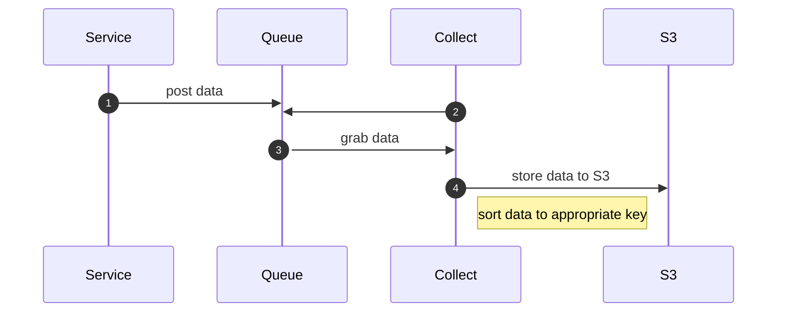
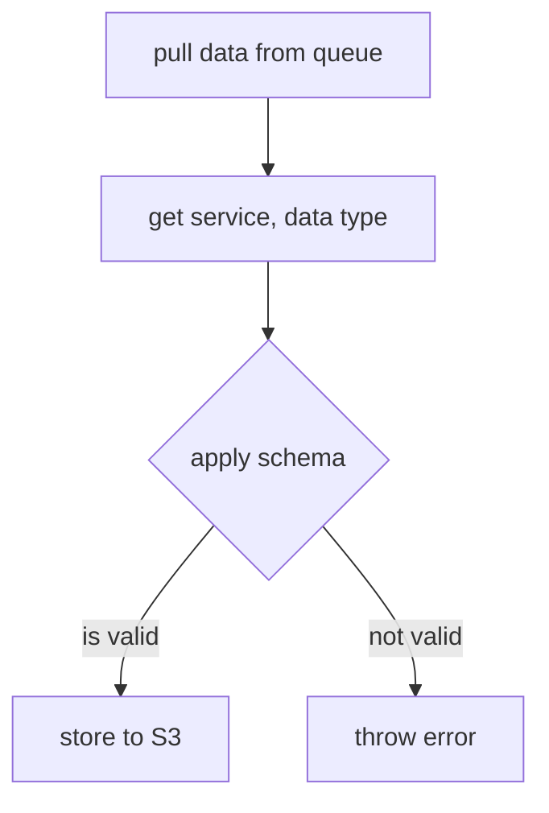

# collect


We need multiple kinds of data from our services.

1. **Service performance**. Jemison itself has operating parameters we'd like to track. For example, we can use Golang's memory monitoring tools to [capture and analyze](https://stackoverflow.com/questions/24863164/how-to-analyze-golang-memory) things like heap usage, allocations, GCs, and so forth. This will help us spot leaks (if we have them) and so on.
2. **Service performance**. At the application (as opposed to system) level, we may want to track the time of some activities. For example, how much time do we spend reading/writing objects to S3? Postgres? Unlike memory/heap usage, we have to explicitly capture this data as part of our application logic. (For example, we may want to periodically query [user table statistics](https://kaleman.netlify.app/getting-query-performance-stats-with-pg).
3. **Service use**. What queries do we receive, from where, and at what rate? What is the clickthrough rate on queries? 

These and other needs will arise. What we want is a common architecture that is in keeping with the rest of the stack for capturing this data.

Given the architecture of Jemison as a whole, we'll leverage our queue. In a picture:



Because every service already knows how to talk to the queue, we'll use the queue to ship data from any given service to `collect`. It will be `collect`'s responsibility to pull the data from the queue, sort it, and store it into the appropriate table for processing.

Consider the following concrete example:

1. `fetch` will keep track of how many pages it fetches.
2. Every 5 minutes, `fetch` will post to the `collect` queue a message containing:
   1. The name of the service posting the data (e.g. `fetch`)
   2. The name of the data being posted (e.g. `pages_fetched`)
   3. A JSON document containing the data (e.g. `{ "five_minutes": 123, "since_startup": 123456 , "epoch_nanos": 190231231231 }`)

The `collect` service will pull this off the queue, and stash the JSON document into S3. It will stash the data at 

```
2025-01-22/fetch/pages_fetched/234234123123234.json
```

where the key is the number of nanoseconds since the Unix epoch, as recorded by the service in the `epoch_nanos` field.

## data structures

Data will ship in a JSON structure that looks like:

```
{
  "source": <string>,
  "data_id": <string>,
  "data": <JSON document>,
  "epoch_nanos": <int64>
}
```

This will provide a standard queueing format for all data types. Although it is possible that two services might record a piece of data at the same nanosecond, it 1) seems unlikely, and 2) we will store different kinds of data at different paths in S3.

### validation

JSON is dangerous. It is easy to create, ship, somewhat easy to parse, and easy to make mistakes with. (E.g. shipping `epoc_nanos` instead of `epoch_nanos`.) Therefore, **every data element will be validated via JSON Schemas** ([documentation](https://json-schema.org/learn/getting-started-step-by-step#creating-your-first-schema)) before being stored to S3.

In the `collect` service directory, we will store schemas in a `schemas` directory. Schemas will be defined in Jsonnet. Why? So common patterns can be abstracted out over all of our schemas. As part of our build, we will:

1. Compile our JSonnet Schemas into JSON Schemas.
   1. This has the benefit of guaranteeing that the resulting schemas are valid JSON.
2. Embed the JSON Schemas into the `collect` service via an [embedded filesystem](https://gobyexample.com/embed-directive).
   1. This has the benefit of guaranteeing that the schemas will be available at time of operation.

We might lay out the `schemas` directory using a `<source>/<data_id>` structure, to mirror the object we ship to `collect`.

The schema for the top-level `collect` object might be described as:

```json
{
  "$schema": "https://json-schema.org/draft/2020-12/schema",
  "$id": "https://search.gov/collect.schema.json",
  "title": "Data collection schema",
  "description": "The schema applied to all top-level data collection objects",
  "type": "object",
  "properties": {
    "source": {
      "description": "The service generating the data",
      "type": "string"
    },
    "data_id": {
      "description": "A short identifier for the data unique to the service",
      "type": "string"
    },
    "data": {
      "description": "The data itself",
      "type": "object"
    },
    "epoch_nanos": {
      "description": "The time in nanoseconds since the data was collected, according to the service",
      "type": "integer"
    }
  }
}
```

(Note, that is expressed in JSON, not JSonnet.) It is up to `collect` to use the `source` and `data_id` fields to look up the correct schema in order to validate the `data` field.

## collect in operation

When `collect` is in operation, it will:




In short, all collect does is pull things from the queue, grab the JSON, validate the JSON, and write the JSON document to S3 at the appropriate key. It does not *process* data, it just makes sure it is in the correct *shape*.