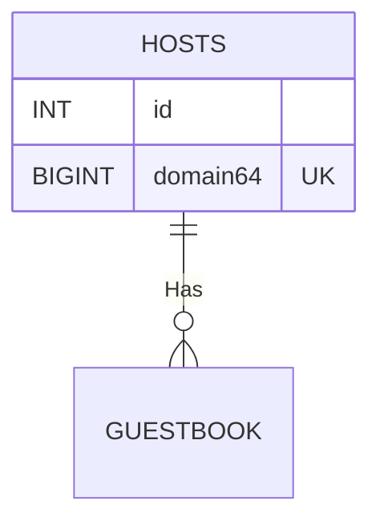

# work db

The "work" DB is where day-to-day application work takes place. Data supporting the crawling/indexing work, for example, lives in this database. It is separate from the queues (which are high frequency, small data transactions) and search (which is read heavy).

[//]: # ( O| - Zero or one )
[//]: # ( || - One and only one )
[//]: # ( O{ - Zero or many )
[//]: # ( |{ - One or many )



## guestbook

The guestbook is where we keep track of URLs that have been/want to be searched. These tables live in the `cmd/migrate` app, which handles our migrations on every deploy. [These are dbmate migrations](https://github.com/GSA-TTS/jemison/tree/main/cmd/migrate/work_db/db/migrations).

```sql
create table guestbook (
  id bigint generated always as identity primary key,
  domain64 bigint not null,
  last_modified timestamp,
  last_fetched timestamp,
  next_fetch timestamp not null,
  scheme integer not null default 1,
  content_type integer not null default 1,
  content_length integer not null default 0,
  path text not null,
  unique (domain64, path)
);
```

The dates drive a significant part of the entree/fetch algorithms.

* `last_modified` is EITHER the timestamp provided by the remote webserver for any given page, OR if not present, we assign this value in `fetch`, setting it to the last fetched timestamp.
* `last_fetched` is the time that the page was fetched. This is updated every time we fetch the page.
* `next_fetch` is a computed value; if a page is intended to be fetched weekly, then `fetch` will set this as the current time plus one week at the time the page is fetched. 

## hosts

```sql
create table hosts (
  id bigint generated always as identity primary key,
  domain64 bigint,
  next_fetch timestamp not null,
  unique(id),
  unique(domain64),
  constraint domain64_domain 
    check (domain64 > 0 and domain64 <= max_bigint())
)
;
```

Like the `guestbook`, this table plays a role in determining whether a given domain should be crawled. If we want to crawl a domain *right now*, we set the `next_fetch` value in this table to yesterday, allowing all crawls of URLs under this domain to be valid. 
