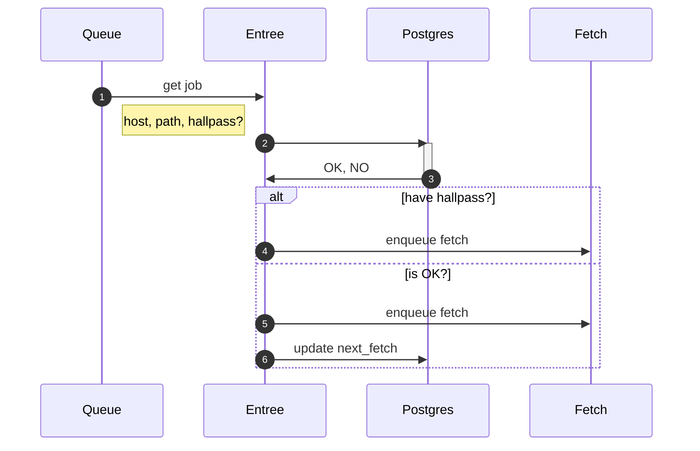
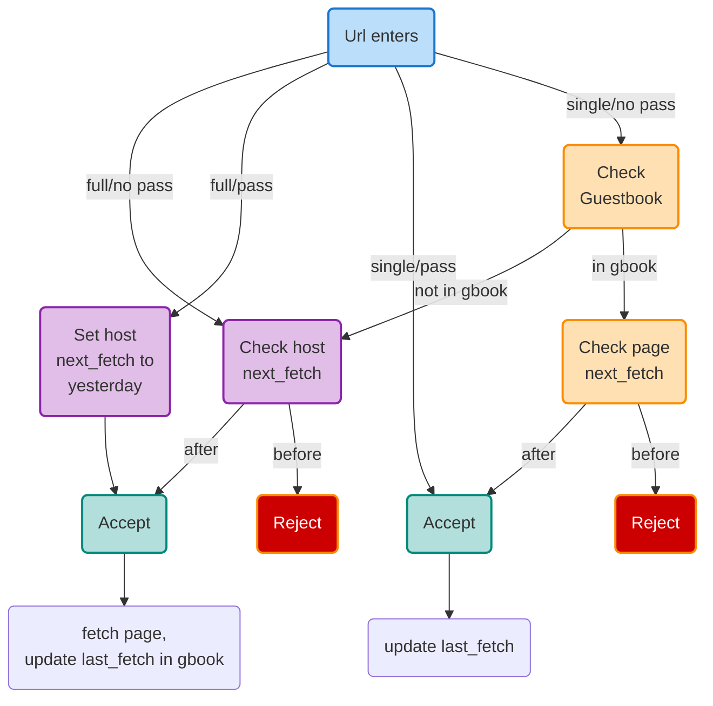

# entree

Entree keeps track of what is coming in the front door.



The `entree` component decides what URLs can, or cannot, come in the door.

It helps maintain a `guestbook`. The guestbook looks roughly like:

```sql
CREATE TABLE IF NOT EXISTS guestbook (
  id BIGINT generated always as identity primary key,
  scheme scheme NOT NULL,
  host BIGINT references hosts(id),
  path TEXT NOT NULL,
  content_sha1 TEXT,
  content_length INTEGER,
  content_type INTEGER references content_types(id),
  last_updated DATE,
  last_fetched DATE,
  next_fetch DATE,
  UNIQUE (host, path)
);
```

URLs enter the system via one of three ways at the moment:

1. The `admin` API component
2. A scheduled kickoff of a crawl, or 
3. The `walk` component

For example, if we kick off a crawl of `allthe.gov`, that URL is sent to `entree`. That URL may have a `weekly` cadence. 

* If we last crawled it on Monday, it is now Wednesday, and the `next_fetch` date is the Monday prior, we will quiety ignore the message. (Log it, etc. perhaps.)
* If we craweled on Monday, it is Wednesday, and `hallpass?` is `TRUE`, it means we injected this with the intent of running it now. We do two things (and *don't* do one):
  1. Rewrite the `next_fetch` on all URLs for this host to three minutes in the past.
  2. Enqueue the URL to `fetch`
  3. Do *nothing* to `next_fetch`
* If we crawled on Monday, and it is now Tuesday of the next week, we pass this on to `fetch`, and set `next_fetch` appropriately.

In short, `entree` is the doorkeeper. If we are running normally, we're enqueueing *everything* every night. We let `entree` filter it appropriately. If we are forcing the issue---saying we need to reindex a domain *right now*, then `entree` sets the "next fetch" date to a point in the past to make the crawl possible. 

After we `fetch` a page succesfully, the `fetch` service will update the "last fetched" date in the guestbook. This prevents us from re-fetching a page over-and-over.

## rules

The rules are encoded directly into `entree`. In a future version, we might find a way to encode these rules in a DSL. For now, the flowchart below is directly encoded in Go as if/else statements. 



### tooling

`dbmate` is used to manage the `guestbook`. This is currently managed by the [migrate](migrate.md) application directly.) `dbmate` is a standalone tool, and could be extracted and scripted separately. 

It is a (largely) pure-SQL tool, and helps keep migrations expressed in a lowest-common-demoninator language. Having the app run the migrations directly is possible because `dbmate` is written in Go, and can be used as a library. However, pulling it out and running it via the `dbmate` command-line tool adds nothing in a future refactor.

## resources

* https://github.com/amacneil/dbmate