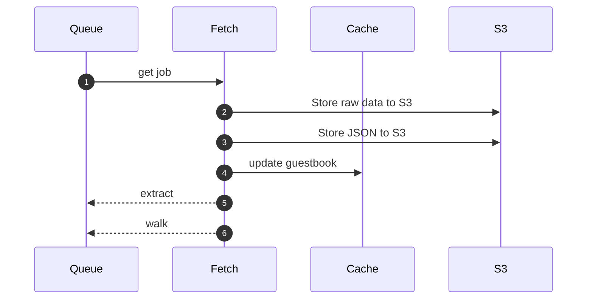

# fetch

Fetch follows a simple sequence:

1. Pull a job from the queue
2. Fetch the content
3. Store the content
4. Update the guestbook

Fetch stores both the raw (byte-for-byte) content to S3 as well as a JSON document. These are named for the SHA1 of the URL/path, with the extensions `raw` and `json`, respectively.

## next steps

We enqueue two further jobs:

1. [extract](extract.md) will extract the content from types we handle: PDF and HTML.
2. [walk](walk.md) only processes HTML; it goes through the document looking for links, and sends them back to the pipeline.

