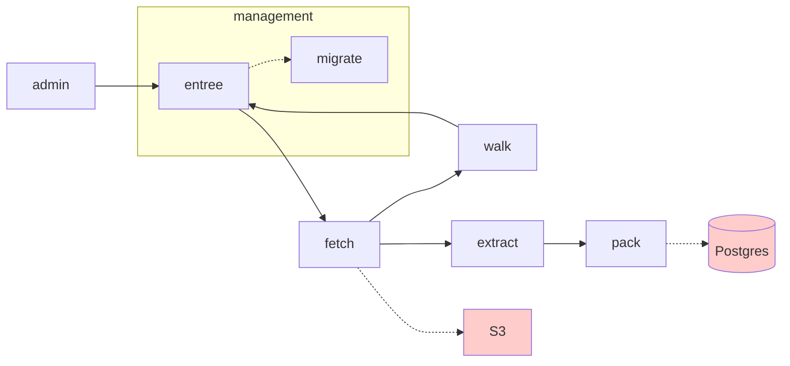

# the service pipeline

1. A URL comes in, perhaps from the `admin` component (which may be reading a config file), or from our link `walk`er.
2. [entree](entree.md) checks to see if we should fetch this URL. Perhaps it has been fetched recently, and therefore we will quietly ignore this URL. Or, perhaps it is stale, and we need to continue. In which case, the URL is enqueued for `fetch`.
      1. Entree runs [migrate](migrate.md) before doing anything else. Migrate is not a service; it runs the migrations and exits. 
3. [fetch](fetch.md) grabs the URL, and copies it to S3. It enqueues a message for `walk` and `extract`.
4. [walk](walk.md) gets the page from S3, goes through the HTML, and finds all hyperlinks, sending them back to `entree`'s queue.
5. [extract](extract.md) grabs the page from S3, pulls all of the text from the page, and stores that back into S3. (Any text processing we want to do should happen here.) A message is enqueued to `pack`.
6. [pack](pack.md) takes the texts and packs it into our database. Any uniqueness constraints, etc. are handled at this point.

Not shown (and to-be-written) is `validate`. This is a service that expects to handle messages from most/any/all other services. It validates the output from any given service. For example, `fetch` should leave a `.raw` file as well as a `.json` object in S3. The `validate` service should check that the JSON object exists, and the associated "raw" file (not to be confused with RAW files in the world of photography) is of the correct type, size, etc. Or, at the least, assert that we have not created a zero-length file in S3 (which would be an error condition). In short, `validate` makes sure the system is continuously operating within the set of constraints we define as "good."