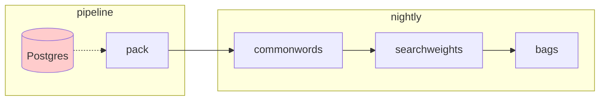

# processing

[pack](pack.md) is the first step of the data cleanup pipeline. It does a minimal cleanup, making sure that we are pulling content that is *most likely words*. 

Once we have the raw data in Postrges, we begin another data pipeline. We do not expect that our search engine is "real time." It is OK if we process data nightly/weekly/etc. In this regard, S3 and Postrges are just the starting point.

The purpose of this pipeline is *search optimization*. We optimize by understanding:

1. What our partners need/want/value
2. What the public needs/wants/values
3. What we can learn from the text
4. What we can learn from user searches

We also need to understand the last 20 years of search engine usability literature...

Some initial/uninformed thoughts:

1. **commonwords**. This process looks at all of the content on a given domain and identifies the most common terms. These are then loaded into a `commonwords` table. This table maps the common words to subsets of the domain; for example, it stores all the most common words in `blogs.nasa.gov`, as well as the articles those words show up in.
2. **searchweights**. We take the searches that have been performed against a domain, and use that to generate the most common search terms. These are cumulative. We store these for combination with other data.
3. **bags**. Just like we take our canvas bags to the supermarket, we make up bags of words and the pages they refer to. We use the `commonwords` and `searchweights` to create fast lookup tables; this way, if someone enters `moon landing` as a common search, and we know all the articles containing these terms, we can rapidly return the subset of pages for these searches. The `bags` algorithm pre-computes the 500 most common search terms for each domain.

## notes

* Non-expert search in complex domains (consumer health search)
    * https://www.mdpi.com/2078-2489/15/11/695
* Exploratory/directed search strategies at a social science data archive
    * https://iassistquarterly.com/index.php/iassist/article/view/1087
* Measuring and Improving the Efficacy of Curation Activities in Data Archives (poster)
    * https://deepblue.lib.umich.edu/handle/2027.42/163501 
* Berrypicking
    * https://pages.gseis.ucla.edu/faculty/bates/berrypicking.html
* TopicShop: enhanced support for evaluating and organizing collections of Web sites
    * https://dl.acm.org/doi/10.1145/354401.354771
* The tangled Web we wove: a taskonomy of WWW use
    * https://dl.acm.org/doi/10.1145/302979.303154

## references
* https://dl.acm.org/doi/10.1145/775047.775067
* https://dl.acm.org/doi/pdf/10.5555/188490.188554
* https://dl.acm.org/doi/10.1145/347090.347176
* https://cdn.aaai.org/Workshops/1996/WS-96-06/WS96-06-001.pdf
* https://dl.acm.org/doi/10.5555/2980539.2980623
* https://pi.math.cornell.edu/~mec/Winter2009/RalucaRemus/Lecture3/lecture3.html
* https://www.cis.upenn.edu/~mkearns/teaching/NetworkedLife/pagerank.pdf
* https://acme.byu.edu/00000180-6956-dde7-ad8c-6dde900c0001/pagerank
* https://www.mdpi.com/2078-2489/15/11/695