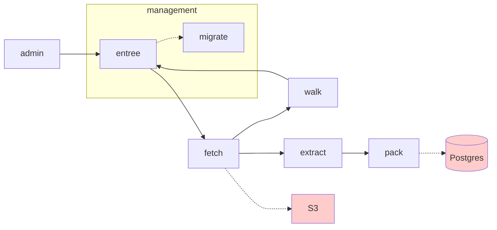
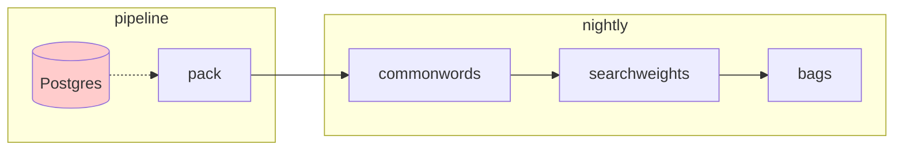

# Jemison Architecture

Jemison is a starting point for a reworking of Search.gov.

Our [principles](principles.md) and [tooling](tooling.md) may change over time, but we aspire to keep things simple, both conceptually/from a systems design perspective as well as in the choice of tools we use.

## a data capture pipeline

Jemison is a queue-driven data pipeline.

The first half of Jemison is a set of Golang services that pull content from the WWW and store it in S3 and Postgres. 

Read more about the [data capture pipeline](pipeline.md).

## a data processing pipeline

Once we have the content in Postgres, we have another powerful language at our disposal: SQL.

At this point, further services clean, process, and prepare the text for search.

Read more about the [data processing pipeline](processing.md).

## a source of data

We collect data about Jemison (to understand its performance) as well as how our users interact with Jemison (so we know what they're searching for, and we can deliver a better experience to the public). 

We serve the public. It is in their interest to have their privacy protected when they use Jemison. Therefore:

1. We do **not** collect individually identifiable information. 
2. We do **not** collect information that would allow us to identify individuals through aggregate operations.

**We hold the public's trust**, and part of maintaining that trust is that we will collect information that allows us to deliver a better service, but will preserve the publics privacy as they work to find what they need from Federal services.

