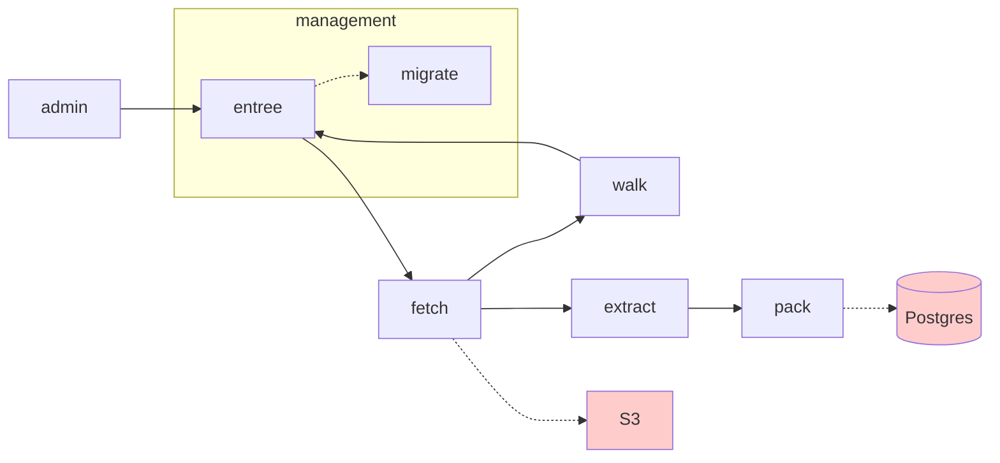

# Jemison Architecture

Jemison is a starting point for a reworking of Search.gov.

Our [principles](principles.md) and [tooling](tooling.md) may change over time, but we aspire to keep things simple, both conceptually/from a systems design perspective as well as in the choice of tools we use.

## a data capture pipeline

Jemison is a queue-driven data pipeline.

The first half of Jemison is a set of Golang services that pull content from the WWW and store it in S3 and Postgres. 

Read more about the [data capture pipeline](pipeline.md).

## a data processing pipeline

Once we have the content in Postgres, we have another powerful language at our disposal: SQL.

At this point, further services clean, process, and prepare the text for search.

Read more about the [data processing pipeline](processing.md).
