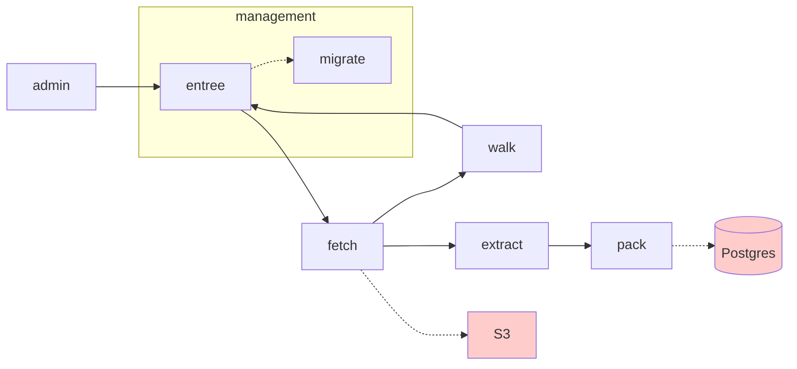
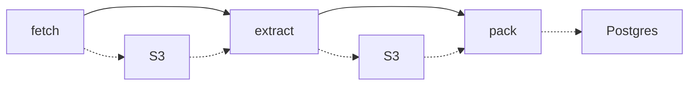
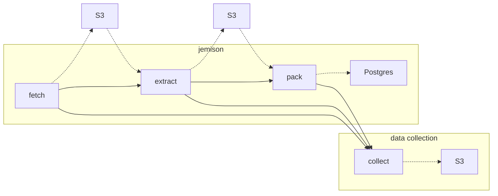
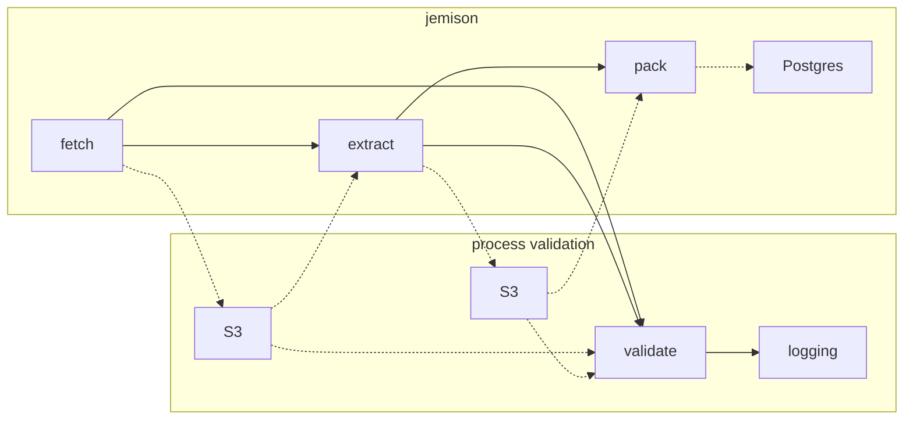

# the service pipeline

1. A URL comes in, perhaps from the `admin` component (which may be reading a config file), or from our link `walk`er.
2. [entree](entree.md) checks to see if we should fetch this URL. Perhaps it has been fetched recently, and therefore we will quietly ignore this URL. Or, perhaps it is stale, and we need to continue. In which case, the URL is enqueued for `fetch`.
      1. Entree runs [migrate](migrate.md) before doing anything else. Migrate is not a service; it runs the migrations and exits. 
3. [fetch](fetch.md) grabs the URL, and copies it to S3. It enqueues a message for `walk` and `extract`.
4. [walk](walk.md) gets the page from S3, goes through the HTML, and finds all hyperlinks, sending them back to `entree`'s queue.
5. [extract](extract.md) grabs the page from S3, pulls all of the text from the page, and stores that back into S3. (Any text processing we want to do should happen here.) A message is enqueued to `pack`.
6. [pack](pack.md) takes the texts and packs it into our database. Any uniqueness constraints, etc. are handled at this point.

Not shown above is [collect](collect.md) or [validate](validate.md). These two services live "in-between" all the other services.

## collect

Consider: `fetch` places data into `S3`, which is then retrieved and operated on by `extract`.

In addition to doing this work, each process might report on aspects of its work so that we can then do analytics on that data. We might want to know how many documents are fetched every 5 minutes, for example. This data is reported to `collect`.

Code (potentially run nightly, etc.) will process the S3 data into usable information.

## validate

`validate` plays a different role: it makes sure that the outputs of any given service are correct.

1. `fetch` processes data, and stores it in S3.
2. `fetch` enqueues a message to `validate`
3. `validate` retrieves the data from S3, checking assertions (e.g. the data exists, etc.)

`validate` proceeds to say nothing if everything looks good; if `validate` finds something it doesn't like, it might `WARN` or `ERROR`, and in doing so, place a message in our logging service. We can then write alerts that trigger on this high signal-to-noise component. When `validate` finds something worthy of a warning or error, it becomes an immediate "bat signal" for us to improve the service that (perhaps) placed faulty or malformed data into Postgres or S3. In this regard, we have a tool that, even in production, helps guarantee the quality of Jemison's data pipeline.