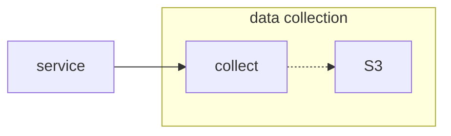

# accumulate

The accumulator takes its name from electronics and other flow-based environments: it takes multiple inputs and turns it into a single output. `accumulate` does this work in the context of `collect`---or, the data we collect about the operation of the system.

## revisiting collect

As a reminder, (probably) every process in our system reports data to `collect`. 



`collect` works well when the service has data to report *right now*. It works less well when the data comes in [pieces-parts](https://www.youtube.com/watch?v=OTzLVIc-O5E). When that happens, we have a problem where one part of our data might come early in the search process, and another piece comes later.

Here is the problem.

1. A user visits funky.gov. They do a search. At funky.gov, they're using our new JS-based search tooling, meaning they fire off a search using a `POST` from JS in the page.
2. We process the query. At this point in time (`T1`) we know 1) the query and 2) the results we provided.
3. Now, funky.gov builds a webpage (this is a later point in time, or `T2`). The user clicks on the second link (because the first search result is never funky enough). At this point... the page was built dynamically on funky.gov, and *we have no idea what the user did*.  

So:

* At `T1`, we know what they searched for, and what we recommended as results.
* At `T2`, we know what they selected.

If we `collect` data at T1 and T2, we have no idea how the data connects up. Ultimately, this means neither we nor our partners have any idea how effective search is.

To connect these two pieces of data, we need an identifier, and a way to turn a stateless data collection into a stateful data collection.

### the fix

Now, revisiting the scenario.

**The user does a search**. This fires off a `POST` to the search.gov backend.

**We reply, along with a result-UUID**. In other words, we return an object that looks like this:

```
{
  result-id: "cbe8738a-f372-11ef-94f4-5b09af304eac",
  results: [
    {
      url: "https://funky.gov/chic",
      position: 1
    },
    {
      url: "https://funky.gov/funkadelic",
      position: 2
    },
    {
      url: "https://funky.gov/tower-of-power",
      position: 3
    }
  ]
}
```

**funky.gov builds the result page**. We have already provided a library of code for our partners to use. Part of that library will be a function that can attach handlers to every result link on the page. Given the results (above), it will attach a JS handler to a result link that, when the link is clicked, it:

1. Fires off a POST to our API (e.g. `api.search.gov/results-data/cbe8738a-f372-11ef-94f4-5b09af304eac`)
   1. The post includes information about the link clicked, the client type (e.g. `desktop`, `mobile`, etc.)
2. If the `result-id` is fresh, we store the data.
   
This is essentially a timed token protocol. We will give the tokens a fixed lifetime (e.g. 10 minutes); if we get clicks within that window, we will log the data. Once the token expires, we ignore it and the associated data.

The end result is we end up with two different JSON objects being stored in S3. One is from the `resultapi` service (where the query happened) and another from the partner's webpage (where the interaction with the results happened). We connect those two pieces of data after-the-fact with the `result-id` as an identifier.

We need to track this, and gather it up. This is where `accumulate` comes in.

## accumulating the data

The `resultsapi` process will drop data into `collect` that includes an `accumulate-id`. That is, we might store:

```
{
  host: "nasa.gov",
  query: "moon landing",
  accumulate-id: "cbe8738a-f372-11ef-94f4-5b09af304eac"
  accumulate-timeout: 600 // 10 minutes
}
```

Because this is data we will want to combine later, `accumulate` should keep an eye out for the `accumulate-id` key. When it sees one, it should build an ancillary table. 

we need to drop a note to `accumulate`. We enqueue a message that includes both 1) the id of the JSON object in the bucket, and 2) the `accumulate-id`. Accumulate might maintain a database that looks like

| row id | object key | accum id | expires | 
| --- | --- | --- | --- |
| 1 | resultsapi/83218ac34c1834c26781fe4bde918ee4.json | cbe8738a-f372-11ef-94f4-5b09af304eac | *now + 600* |
| 2 | resultsapi/de18e6b63a3c9e2e9504410b30b656df.json | 77b6e38a-f388-11ef-8b64-03875969d502 | *now + 600* |

This would represent two query objects that came in to the `resultsapi` process. Collect knows the object key, and it knows that it wants to be accumulated. 


| 3 | results-data/ea3997c98af48e6aaabb0c175bad27d5.json | cbe8738a-f372-11ef-94f4-5b09af304eac |


Now, when a data collection ping comes in (e.g. to `api.search.gov/results-data`), we have a second post to `collect`.

```
{
  host: "nasa.gov",
  result-id: "cbe8738a-f372-11ef-94f4-5b09af304eac",
  position: 2,
  device-type: desktop
}
```

However, we know this is the end of the process. So, we should drop a message to the `accumulate` queue that looks like this:


Later, we can either have `accumulate` run as a nightly service, or we can do accumulation as an async process whenever the second half of metadata arrives. The former makes it easier, in some ways: every night, we move all of the data into a Postgres database, and then use SQL to join the two tables on the `result-id`. This is probably the simplest solution. 

Less simple would be to store the data in such a way that we can easily, while executing, connect the data up. For example, `accumulate` could use the domain name and result-id to grab the appropriate objects from S3, do the combination, and then fire off a new message to `collect` that merges everything into a single JSON object. It could, then, clean up its own bucket, so we do not... accumulate... accumulations... of... accumulated... oh, nevermind. (O_o)

Either way, the end result is that we have a way to connect data through time, and do so in an untrustworthy environment.

## security concerns

There are more things we can (and should/must) do to protect ourselves. Because the API is open, a storage-flooding attack could be staged using this.

1. A malicious site, meanie.com, issues a query.
2. They get a valid result set, and a `result-d`.
3. Now, meanie.com fires off a never-ending stream of fake data packets to the result API server.

We can defend against this in one of several ways.

**Each token has a limited lifetime**. We can assume users don't interact with a given result page for more than (say) 30 seconds. (Research must exist that tells us what this value should be; it will be surprisingly short.) In this way, we only care about timely/rapid interactions. And, it means that we can only be attacked on a given token for a limited period of time.

**We could limit the number of data pings in time**. That is, if someone pings us with data more than once per two-second window, we drop the last ping.

If we use all both of these approaches together, we set a hard upper bound on how many pieces of data we can collect from a given page.

```
(lifetime / rate_window) = max_pings
```

For example, with 10 results, a lifetime of 30 seconds, and a rate window of 2 seconds, we can get a maximum of 15 pings.


**We can limit the number of data pings based on the number of results**. If we return 10 results, we can assume that a user only clicks on each once.

This gives us a hard upper bound of 10 possible data pings in a given time window: one ping per URL.

**We could make every token a nonce or counter**. That is, it might be that we only ever collect one click from the end-user for tracking. We can make this a variable, and later consider collecting up to (3, 5, 8) clicks from the user. This strikes a balance between possible flood attacks and collecting data.

This would allow us to set a fixed bound. We could limit the client to (say) one piece of data per page, or two, or five. 

**Fix the data response size**. What comes back should be bounded in scope/extent. We should be expecting only a few possible values (URL position in the list, client type), and as a result, the data posted to us should be 1) small and 2) strongly typed/restricted. This prevents an attacker from trying to fill our disk with garbage, because we're effectively only collecting a few integers.

Some combination of these approaches locks down the data collection API.

## implementation details

