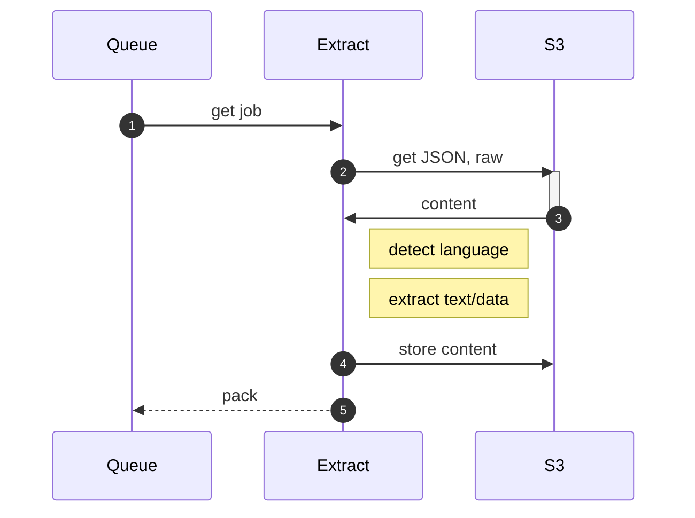

# extract

Extract converts raw content into something that can be indexed or otherwise further processed for search.

Extract:

1. pulls the plain text from HTML pages, storing the content as a single object in S3
2. pulls the plain text from PDFs, storing the content as one object per page.

The URLs for the PDFs are ammended with `#page=N`, which we also pass through for further queueing. In this way, a single PDF may become tens, hundreds, or even thousands of jobs on the queue---one job for each page.

## next steps

At this point, we have content that is minimally cleaned. [pack](pack.md) takes the content on to the next half of our data pipeline.

## resources

* https://awesome-go.com/natural-language-processing/
* https://github.com/pemistahl/lingua-go
* https://github.com/james-bowman/nlp
* https://github.com/afjoseph/RAKE.Go
* https://github.com/jdkato/prose/
* https://github.com/gorse-io/gorse
* https://awesomerank.github.io/lists/avelino/awesome-go.html#text-processing
