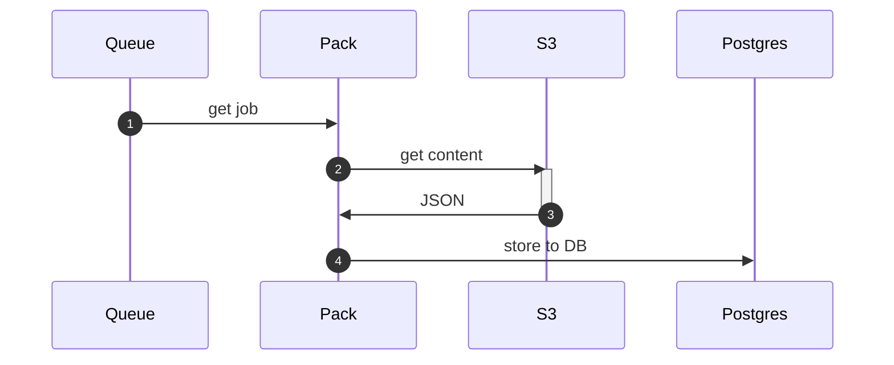

# pack

Pack takes content and moves it from S3 to Postgres.

`pack` takes content from S3 and moves it to Postgres. It stores the data in a `raw_content` table that is then ready for further (nightly/scheduled) processing.

Pack performs the following transformations on the text:

1. **lowercase**. Everything comes out of `pack` lowercased.
2. **punctuation/accent removal**. All punctuation and accents are removed at this point. Our target languages are English and Spanish. (In Python, we would use `unicodedata` here.)
3. **emoji/emoticon removal**. They are never needed in our context.
4. **unicode normalization**. We need to reduce the space and eliminate any unicode that does not match our target languages. This dives deep into Unicode handling.

## future thoughts

The original design for `pack` was to create and distribute SQLite databases. These are highly performant, but Cloud.gov restricts droplets to 7GB. As a result, we cannot create individual databases that are small enough in some contexts. (And, even if we compress the databases, the act of creating them might creep above 7GB.)

We may want to perform more content cleaning at this stage. We can either extend the pipeline (inserting jobs before `pack`) or extend the scope of `pack`.

## references

* https://www.cloudflare.com/developer-platform/durable-objects/
* https://blog.cloudflare.com/introducing-workers-durable-objects/
* https://stackoverflow.com/questions/11066400/remove-punctuation-from-unicode-formatted-strings
* https://nedbatchelder.com/text/unipain.html
* https://towardsdatascience.com/what-on-earth-is-unicode-normalization-56c005c55ad0
* https://withblue.ink/2019/03/11/why-you-need-to-normalize-unicode-strings.html
* https://stackoverflow.com/questions/15985888/when-to-use-unicode-normalization-forms-nfc-and-nfd
* https://lhncbc.nlm.nih.gov/LSG/Projects/lvg/current/docs/designDoc/UDF/unicode/unicodeNormalization.html
* https://go.dev/blog/normalization
* https://gist.github.com/ciscorn/e0be0852b9ebe812b4e1787b77de397e
* https://unicode-programming.readthedocs.io/en/latest/normalization/go/