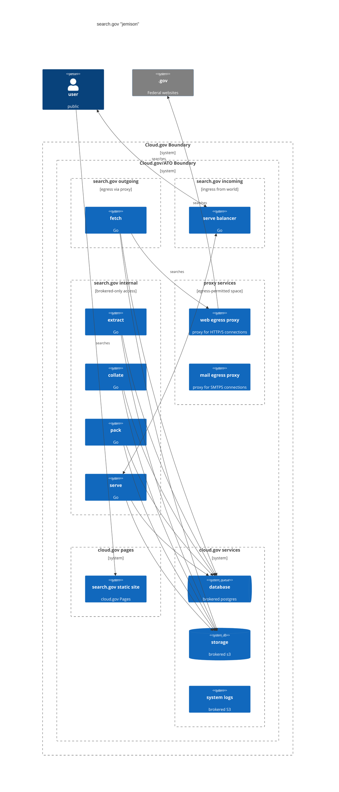
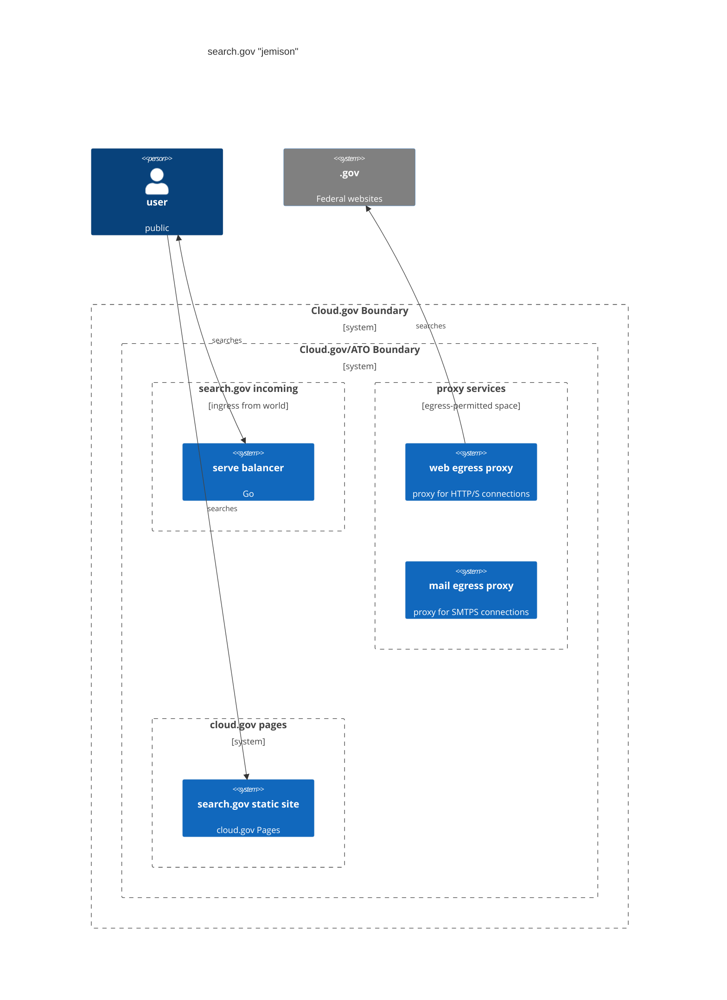

# system diagram

The `jemison` system is composed primarily of small components that communicate with a queue. That queue is stored in a relational database for stability.

This also means that the majority of the system is not visible to the public.

## full system

Below is the full `jemison` system.

* The public talks to the `serve balancer`, which routes their query to one of the backend `serve` components. We do this because some sites are larger than others, and therefore need to be hosted on separate servers.
* The `fetch` component (through the `egress proxy`) fetches web pages. It stores the content of those pages in an `s3` bucket brokered by [cloud.gov](https://cloud.gov).
  * This means all content fetched from the WWW goes through an egress proxy.
* The `fetch` component knows what to fetch by checking the queue (in a brokered `posgres` database), and it enqueues work for other components in that database.
* The `extract`, `collate`, and `pack` services all talk to the database and s3. They have no interactions with the outside world.
* The `static site` is a [cloud.gov pages](https://cloud.gov/pages) site, and has "no moving pieces."

### public-facing diagram

We can simplify this diagram by showing only the pieces that interact with the outside world.

In this simplified view, we see that the majority of the services in the system all communicate within the ATO boundary. Users interact with the serve balancer, and the system fetches content from the world through the egress proxy.

Of these, **the only surface that is *inbound* is the serve balancer**. The egress proxy makes *outbound* requests for content from the world, but no connections are *inbound* to the proxy.