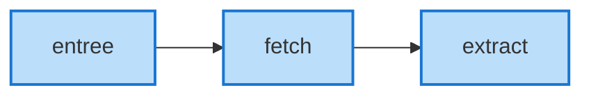
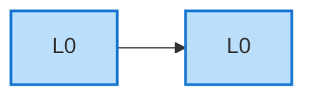
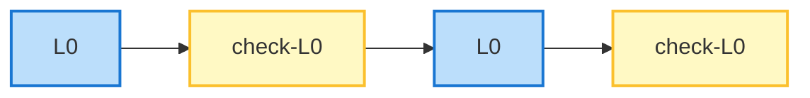
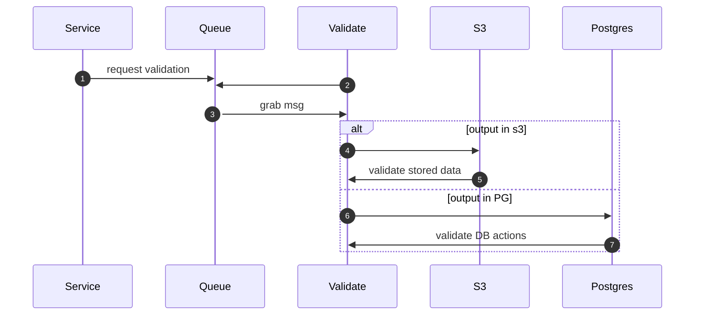

# validate

In most software applications, we think of two kinds of tests: unit tests, and end-to-end/integration tests. `validate` is something in-between. It's design is inspired by the work of Sarkar, Waddell, Dybvig, Keep, and others on [nanopass compilers](https://legacy.cs.indiana.edu/~dyb/pubs/nano-jfp.pdf).

## jemison is a pipeline



We receive URLs into `entree`, evalute whether they are ready/appropriate to crawl, pass them on to `fetch` to copy the page down from the WWW to S3, and then pass a message on to `extract` to pull the page out of S3 in order to extract and process the text of the page. Each arrow represents a message placed on a queue; that is, all inter-service communication happens via a queue.

## validating data transformations

In a nanopass compiler framework, we view a compiler (or, a tool that trasnforms one data structure into another) as a series of correctness- and intention-preserving transformations. That is, if a programmer wrote

```
(+ 3 5 0)
```

then we want to preserve the intent of adding `3`, `5`, and `0`, and make sure that as we trasform from the surface syntax through to assembly, that we preserve the correctness of the code every step of the way. 

A (contrived) correctness-preserving transformation would be to agree that `0` is a no-op in addition. Therefore, the expression `(+ 3 5 0)` can be transformed to `(+ 3 5)`. This transformation does not change the shape of the language; therefore, we might say it is a transformation from `L0` to `L0`. In a pipeline, it might look like this:



In order to *validate* that the compiler has preserved the structure of the language, we could walk the tree, and make sure every node has the correct type (e.g. that the addition expression has two numerical sub-expressions, and so on). Every time a compiler pass outputs `L0`, we can run a function called `check-L0` that makes sure the output of the pass conforms to all expected structures and types.



It is still possible to generate bad code. We could rewrite `(+ 3 5)` to `(+ 3 3)`, changing the meaning of the expression. But, we could not transform `(+ 3 5)` into `(+ 3 TRUE)`. (We could, however, encode the expected result of every test program, and validate that `(+ 3 5)` evaluates to `8` after every single pass... in this way, we would also protect against an error that preserves type but not intent.) 

The `check` passes provide stepwise validation of our work, helping to guarantee that our language transformation pipeline is intent- and correctness-preserving.

## validating jemison pipelines

The Jemison pipeline is made up of services that:

1. Take a message off a queue
2. Fetch, manipulate, and store data
3. Enqueue a message for one or more processes

The purpose of the `validate` service is to help make sure the pipeline in Jemison is, in so many words, intent- and correctness-preserving. Because we work with much more complex/messy data, we can't *exactly* make the same kind of guarantees that we might in a compiler, but we can do *something* to ensure that every service is behaving for every input and output.




Any service in Jemison might request validation. For example, `fetch` should, when operating correctly, create two files in S3 for every action: a `.json` document at a computable key location that contains metadata about a page, and a `.raw` document which is a binary/byte-wise copy of the WWW page or PDF in question. At the end of `fetch`, we currently enqueue two messages: one for `walk` (which then pulls the WWW page, and looks for URLs) and one for `extract` (which pulls text out of HTML pages and PDFs).

`fetch` can also enqueue a message to `validate`. It could be the message contains only the `scheme`, `host`, and `path` of the page, `fetch` might use the optional `JSON` field in the `QSHP` messaging structure to encode additional information for validate. 

When `validate` pulls the message from `fetch` off the queue, it might do any number of things:

* make sure that two files exist in the `fetch` bucket at the expected computing key---one JSON and one "raw"
* validate the JSON document against a known schema
* validate the values in (some, all) metadata keys against expected sets/patterns (e.g. is the content type in an expected set of content types, `text/html`, `application/pdf`, etc.)
* extract the filesize from the JSON metadata, load the file from S3, and validate that the file has the bytelength we expect from the metadata

Some of these are more expensive than others (computationally). We might begin with the simplest possible checks---existence checks---and perhaps validate that the raw file is non-zero in length (which does not require fetching the entire file). 

### future directions for growth

Other services might have different sets of checks.

| service | check |
| -- | -- |
| walk | all values inserted into the job queue parse |
| extract | one or more plain text file(s) created in S3 |
| pack | one or more rows created in Postgres |
| collect | data inserted into S3 |
| *periodic* | the job queue does not grow too long |
| *periodic* | RAM consumption in one or more services does not cross a threshold |

The *periodic* examples demonstrate how the `validate` service could grow. It could use the golang `cron` package to (for example) inspect the `river_job` queue. (The queue is actually just a table in Postgres.) We might have a process running periodically to remove jobs that have been marked as `completed`, and therefore expect that the queue will never have (say) more than 5M rows. We could raise a `WARN` if we ever cross that threshold. 

Similarly, procseses might be posting data to `collect` periodically to report on their average RAM consumption and number of garbage collection events. Given that we should know what the RAM threshold is for each service (e.g. "`fetch` is deployed with 4GB of RAM, and should never peak over 3.5GB"), the `validate` process could monitor the RAM/GC data collected from `fetch` (which would be in either an S3 bucket or PG table) and regularly assert that we are not crossing that threshold.

In short, `validate` can be incrementally grown, over time, as our service-wide output-correctness-validator as well as a very intelligent/targeted service monitor. (Or, we might do that work elsewhere. The point being: the door is open.)

## handling invalid data

We might use our messaging from `validate` in the following way:

* `DEBUG` should be for debugging `validate`
* `INFO` should be for information about the service itself.
* `WARN` for expressions of concern (e.g. crossing a low-level threshold)
* `ERROR` should indicate that `validate` has found an error in data that from another service.

This will be picked up by our logging and alerting service, and we can take appropriate action from there. Initially, **appropriate action probably means fixing the offending service**. For example, if `fetch` is creating 0-length `.raw` files, we should make sure `fetch` does not do that. In this picture, `validate` does not prevent or filter bad content, it just flags it via logging.


### future work

Over time, we may discover/decide that we have the compute capacity to put `validate` in-between services. In this picture, we would have `fetch` enqueue a message to `validate` along with a "destination address." `validate` would check the output of `fetch`, and if it passes, it would then forward the message on to the appropriate destination queue. In this way, we would prevent action from being taken on bad data. This second model mirrors the nanopass framework ideal, but requires significantly more computational resource, as *every* process is then bottlenecked by `validate`. (Or, at that point, we should consider integrating a `validate` worker into every service, so every service validates itself.)